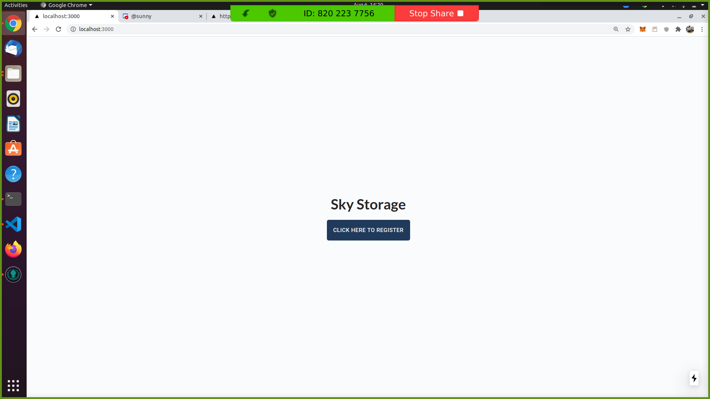
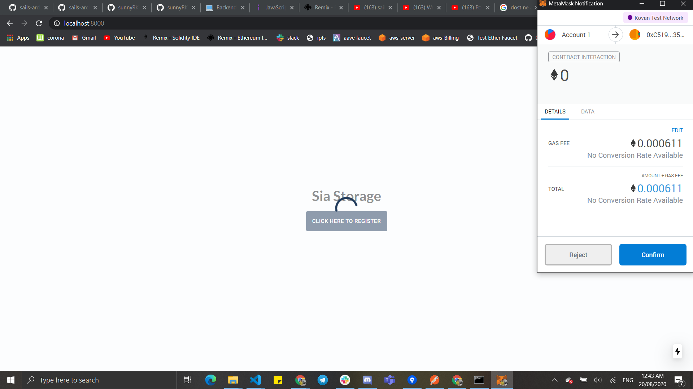
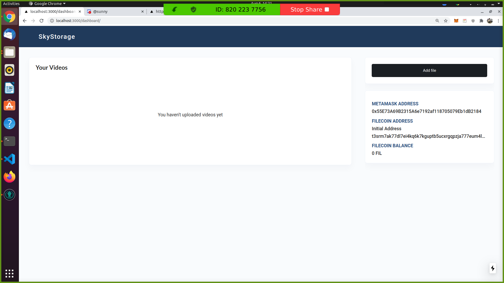
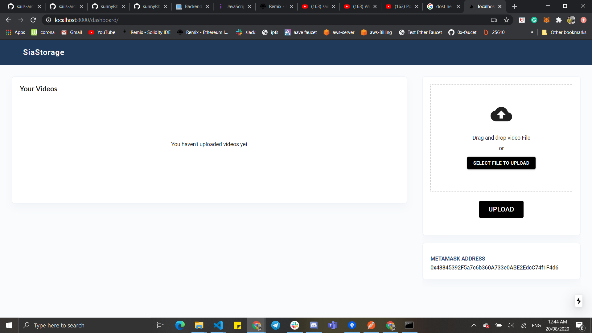
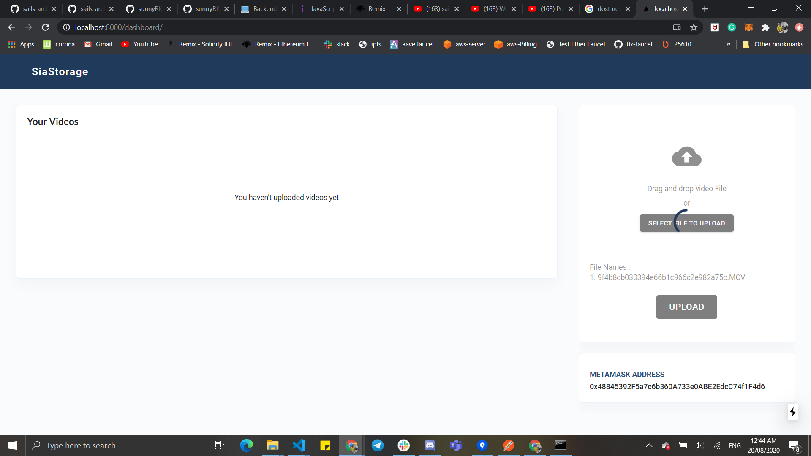
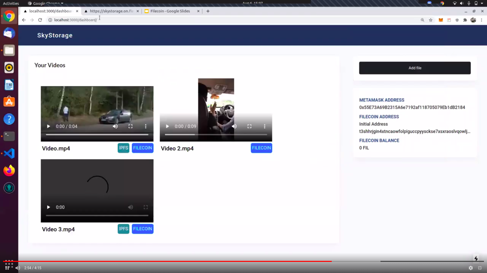

# SiaStorage - (Sia)

SiaStorage is a video player. Where user can upload video on web3 platforms like Sia Storage.   
SiaStorage will retrieve only uploaded videos by login users. And give accessibilty on this video files as a video player on the platform.  
Even, The platform storing the video file details on ethereum blockchain.  

## Screenhots

### 1. SiaStorage Landing Page with register 

### 2. Use will register here
    - Once user press to register, Platform register with his/her metamask address.

### 3. Dashboard
    Successfully registered

### 4. After press Add File,

    - Once user register, user can see dashboard with empty video list
    - Right side you can see metamask address and Add file features to Sia.

### 5. Add file To sia,

    - Select file from computer
    - And Upload

### 6. After upload you can see metamask transaction to upload detais on ethereum smart contract

    - ETH+Sia

### 7. Video Successfully uploaded

### 8. Dashboard with video Gridview and download feature

### 9. Video full view

## How to run and use for devs?

- Run Dapp on localhost  
1). clone repo `https://github.com/sunnyRK/SiaStorage.git`  
2). `cd SiaStorage`  
3). Install dependencies for dapp `npm install`   
4).Run Dapp `node server.js`  
5). Go to `http://localhost:8000`    

## Tech Stack We are using

  - Sia Storage
  - Ethereum (ETH+Sia concept to save file details)
  - Next.Js and Material UI For Frontend

## Contacts

`radadiyasunny970@gmail.com`  
[Twitter](https://twitter.com/RadadiyaSunny)

`rajatbeladiya7@gmail.com`  
[Twitter](https://twitter.com/rajat_beladiya)